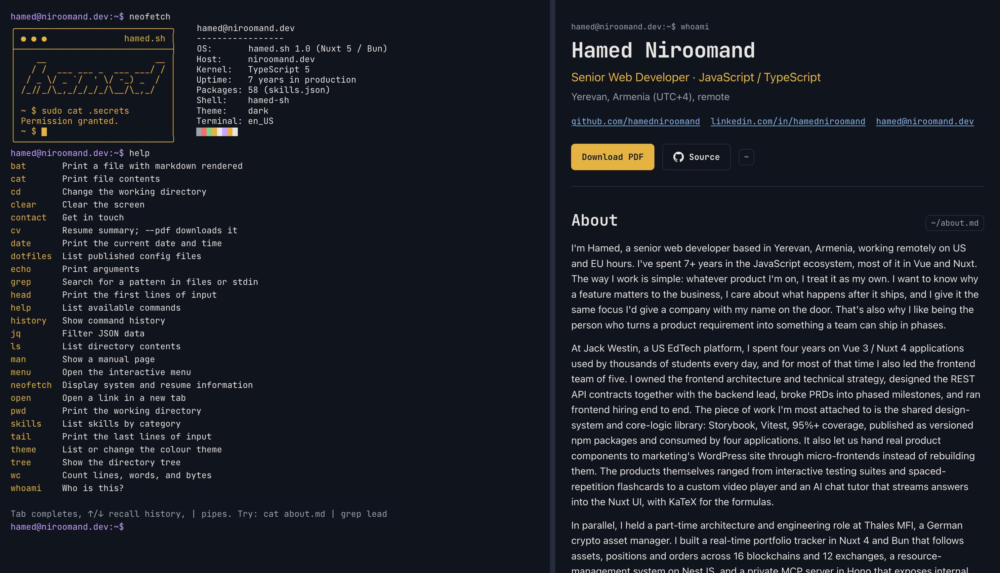

# niroomand.dev

This repository contains the source of my personal resume site. The site has two views of the same
data. Engineers can use a terminal. Everyone else can read a resume panel. When you run a command in
the terminal, the panel scrolls to the matching section.

Live site: <https://niroomand.dev>



## What you can do on the site

- Type `help` to see the commands. The shell supports pipes, `sudo`, Tab completion and command
  history. Try `cat about.md | grep Nuxt` or `sudo cat .secrets`.
- Type `bat <file>` to read a Markdown file with formatting. Type `cat <file>` to read the raw text.
- Type `hamed` to start a guided full-screen app with slash commands such as `/experience` and
  `/skills`.
- Type `theme` to change between five color themes. The site remembers your choice.
- Type `contact` to send me a message from the site.
- Click **Download PDF** in the panel to get the resume as a file.
- Run `curl -s https://niroomand.dev/api/cv | jq .profile` to get the resume as JSON.
- Open <https://niroomand.dev/dotfiles> to read the config files that I use, such as my VS Code
  settings. Each file has a Copy button. In the terminal, each file is at its real path: try
  `cat ~/.config/Code/User/settings.json` or `dotfiles`.

The site works on mobile. It has a Resume tab and a Terminal tab, and a key row for Tab, Ctrl+C and
history.

## Technical notes

These are the decisions in this repository that I think are worth your attention.

**One content source.** All resume data lives in Markdown and JSON files. A local Nuxt module reads
the files at build time and validates them with Zod schemas. Invalid content stops the build and
reports the file path. The terminal, the panel, the JSON API and the SEO tags all read the same typed
data.

**Dotfiles from gists.** Each config file is one entry in `content/dotfiles/*.md` with a mount path
and an optional gist id. The build fetches the gist. When the fetch fails, the build uses the
committed body, so a build never depends on GitHub. [rangi](https://github.com/pi0/rangi) highlights
each file at build time into HTML with classes. One stylesheet maps those classes onto the theme
tokens, so the five themes recolor the code without a client-side highlighter.

**A framework-free shell.** The terminal core is plain TypeScript: a tokenizer, a parser for pipes and
`sudo`, an executor and a command registry. It does not import Vue. Because of this, all of it runs
under Vitest in Node without a browser. Each command is one file. The registry finds new commands
automatically.

**Fast and correct first paint.** The resume panel is prerendered to static HTML. A visitor without
JavaScript, and a search engine, sees the full resume. The terminal is client-only and loads after
the panel. A small inline script restores the saved theme, the split position and the panel state
before the first frame, so hydration never moves the layout.

**A contact form that resists bots.** The form has three layers: a honeypot field, a rate limit of ten
messages per hour per IP, and a Cloudflare Turnstile check. The server verifies the Turnstile token
and fails closed: a network error counts as "not verified". The form validates with the same Zod
schema as the API and shows one error message under each invalid field.

**Accessible by default.** The terminal output is a live region. The divider between the terminal and
the panel is a keyboard-operable separator. Every modal and menu has a role, a name and focus
management. Browser tests check the keyboard paths.

**Quality gates in CI.** Every push runs `vp check` (Oxfmt, Oxlint and type-aware lint), type check, unit
tests with coverage, a production build and the browser tests. Coverage thresholds are 90 percent for lines, branches, functions and
statements. There are more than 300 unit tests and about 50 Playwright tests. Commits follow the
Conventional Commits format and a commitlint hook rejects other formats. A pre-commit hook runs
`vp check --fix` on staged files.

## Stack

| Layer      | Choice                                    |
| ---------- | ----------------------------------------- |
| Framework  | Nuxt 5 (nightly) on Vue 3, Nitro 3 server |
| Runtime    | Bun                                       |
| Language   | TypeScript, strict mode                   |
| Validation | Zod                                       |
| Tests      | Vitest (unit), Playwright (browser)       |
| Tooling    | Vite+ (`vp`): Oxlint, Oxfmt, hooks        |
| CI         | GitHub Actions                            |

I chose the Nuxt 5 nightly on purpose. It let me work with the new Nitro 3 and h3 v2 APIs early and
find the differences from the stable release.

## Run the site locally

You need [Bun](https://bun.sh) 1.4 or later.

1. Install the dependencies:

   ```bash
   bun install
   ```

2. Start the development server:

   ```bash
   bun run dev
   ```

3. Open <http://localhost:3000>.

To run the tests:

```bash
bun run test        # unit tests
bun run build       # production build, required once before the browser tests
bunx playwright install chromium
vp run test:e2e     # builds the e2e app, then runs browser tests
```

The contact form works without configuration. It logs messages to the server console. Copy
`.env.example` to `.env` to connect it to Discord and to turn on the Turnstile check.

## License

MIT
